<p align="center">
  
  
  
  
  
  
</p>

<h1 align="center">🥽 VisionOS UI Framework</h1>

<p align="center">
  <strong>The Most Comprehensive Native VisionOS UI Component Library</strong>
</p>

<p align="center">
  Build stunning spatial experiences for Apple Vision Pro with <b>50+ ready-to-use components</b>,<br/>
  SwiftUI-style syntax, and zero boilerplate.
</p>

<p align="center">
  <a href="#-why-visionos-ui-framework">Why This?</a> •
  <a href="#-features">Features</a> •
  <a href="#-installation">Installation</a> •
  <a href="#-quick-start">Quick Start</a> •
  <a href="#-components">Components</a> •
  <a href="#-architecture-overview">Architecture</a> •
  <a href="#-documentation">Documentation</a>
</p>

---

## 🌟 Why VisionOS UI Framework?

Building UI for Apple Vision Pro is **hard**. You need to juggle RealityKit, ARKit, SwiftUI 3D extensions, hand tracking, eye tracking, and spatial computing paradigms — all at once.

**VisionOS UI Framework** removes that friction. You write familiar SwiftUI-style code; we handle the spatial complexity under the hood.

| | Without Framework | With Framework |
|---|---|---|
| **3D Carousel** | ~60 lines of RealityKit + anchors | 4 lines |
| **Hand-tracked menu** | ARKit session + joint parsing + hit testing | 6 lines |
| **Eye gaze button** | Eye tracking authorization + dwell timer + visual feedback | 3 lines |
| **Glass material** | ShaderGraph + custom material setup | 1 modifier |
| **Learning curve** | Weeks | Minutes |

```swift
// Before: 50+ lines of RealityKit boilerplate
let anchor = AnchorEntity(.plane(.horizontal, classification: .table))
let modelEntity = try! Entity.load(named: "model")
// ... lots more setup code ...

// After: 3 lines of declarative code
SpatialCarousel(items: products) { product in
    ProductCard(product: product)
}
.radius(2.0)
.autoRotate(speed: 0.5)
```

---

## 🏗️ Architecture Overview

```mermaid
graph TB
    subgraph App["🥽 Your visionOS App"]
        direction TB
        A[SwiftUI Views]
    end

    subgraph Framework["📦 VisionOS UI Framework"]
        direction TB
        B[Component API Layer]
        C[Gesture Engine]
        D[Spatial Layout Engine]
        E[Material System]
        F[Accessibility Bridge]
    end

    subgraph Platform["🍎 Apple Platform"]
        direction TB
        G[RealityKit]
        H[ARKit]
        I[SwiftUI]
        J[Accessibility]
    end

    A --> B
    B --> C
    B --> D
    B --> E
    B --> F
    C --> H
    D --> G
    D --> I
    E --> G
    F --> J

    style App fill:#7B68EE,stroke:#5B4ACE,color:#fff
    style Framework fill:#FF8C00,stroke:#CC7000,color:#fff
    style Platform fill:#333,stroke:#555,color:#fff
```

```mermaid
graph LR
    subgraph Components["50+ Components"]
        direction TB
        S1[Spatial Carousel]
        S2[3D Charts]
        S3[Hand Tracking UI]
        S4[Eye Tracking UI]
        S5[Ornaments]
        S6[Window Management]
        S7[Immersive Spaces]
        S8[AR Annotations]
        S9[Custom Materials]
        S10[Volume Views]
    end

    subgraph Modifiers["SwiftUI Modifiers"]
        M1[.glassMaterial]
        M2[.holographic]
        M3[.neonGlow]
        M4[.ornament]
        M5[.spatialHover]
    end

    Components --> Modifiers

    style Components fill:#4A90D9,stroke:#2E5A8B,color:#fff
    style Modifiers fill:#50C878,stroke:#3D9B5C,color:#fff
```





---

## ✨ Features

### 🎯 50+ Spatial Components

| Category | Components |
|----------|------------|
| **3D Components** | SpatialCarousel, Model3DView, VolumetricText, TurntableView, FloatingObject, OrbitView |
| **Spatial Menus** | SpatialMenu, RadialMenu, OrbitalMenu, ContextMenu3D, QuickActionsMenu |
| **3D Charts** | BarChart3D, PieChart3D, LineChart3D, ScatterPlot3D |
| **Hand Tracking** | HandTrackingView, PalmAnchoredMenu, FingerTipButton, PinchSlider, GestureRecognition |
| **Eye Tracking** | EyeTrackingView, GazeButton, AttentionAwareView, GazeScrollView, FocusRing |
| **Ornaments** | ToolbarOrnament, TabBarOrnament, InfoPanelOrnament, MediaControlsOrnament, BreadcrumbOrnament |
| **Window Management** | ManagedWindow, SpatialSplitView, PictureInPicture, WindowSnapping |
| **Immersive Spaces** | ImmersiveContainer, SpatialEnvironment, PortalView, Anchor3D, SharedSpaceCoordinator |
| **AR Annotations** | Annotation3D, ObjectLabel, InfoHotspot, MeasurementAnnotation, StepByStepGuide |
| **Custom Materials** | GlassMaterial, HolographicEffect, NeonGlow, AnimatedGradient, FrostedGlass |
| **Volume Views** | VolumeContainer, VolumetricText, TurntableView, FloatingObject |

### 🚀 Key Highlights

- **SwiftUI-Style API** — Familiar declarative syntax, zero learning curve
- **Zero Boilerplate** — Focus on your app, not plumbing
- **Full Accessibility** — VoiceOver, pointer, switch control support
- **Performance Optimized** — 60fps animations on Vision Pro hardware
- **Xcode Previews** — See your spatial UI in real-time
- **Complete Documentation** — DocC documentation included
- **100% Swift** — No Objective-C, no bridging headers
- **SPM Ready** — One-line integration via Swift Package Manager

---

## 📦 Installation

### Swift Package Manager (Recommended)

```swift
dependencies: [
    .package(url: "https://github.com/muhittincamdali/VisionOS-UI-Framework.git", from: "1.0.0")
]
```

### CocoaPods

```ruby
pod 'VisionOSUIFramework', '~> 1.0'
```

### Requirements

| Requirement | Version |
|-------------|---------| 
| visionOS | 2.0+ |
| Xcode | 16.0+ |
| Swift | 6.0+ |

---

## 🚀 Quick Start

### 1. Import the Framework

```swift
import VisionOSUIFramework
```

### 2. Create Your First Spatial View

```swift
struct ContentView: View {
    var body: some View {
        VolumeContainer(size: .medium) {
            SpatialCarousel(items: products) { product in
                ProductCard(product: product)
                    .glassMaterial()
            }
            .radius(1.5)
            .autoRotate(speed: 0.3)
        }
        .ornament(edge: .bottom) {
            ToolbarOrnament(items: [
                ToolbarItem(icon: "house.fill", title: "Home") { },
                ToolbarItem(icon: "gear", title: "Settings") { }
            ])
        }
    }
}
```

### 3. Add Hand Tracking in 5 Lines

```swift
struct HandMenuView: View {
    var body: some View {
        HandTrackingView {
            PalmAnchoredMenu {
                SpatialMenuItem(icon: "plus", title: "Add") { addItem() }
                SpatialMenuItem(icon: "trash", title: "Delete") { deleteItem() }
            }
            .hand(.left)
        }
    }
}
```

### 4. Build a 3D Dashboard

```swift
struct DashboardView: View {
    var body: some View {
        SpatialSplitView {
            BarChart3D(data: revenue, value: \.amount, label: \.quarter)
                .depth(0.3)
                .colorScheme(.vibrant)
                .animateOnAppear(true)
        } secondary: {
            PieChart3D(data: breakdown, value: \.share, label: \.category)
                .explode(true)
        }
        .splitRatio(0.6)
    }
}
```

---

## 🧩 Components

### 🎠 Spatial Carousel

A 3D carousel for showcasing content in immersive space.

```swift
SpatialCarousel(items: photos) { photo in
    AsyncImage(url: photo.url)
        .frame(width: 300, height: 400)
        .clipShape(RoundedRectangle(cornerRadius: 16))
}
.radius(2.0)              // Carousel radius in meters
.autoRotate(speed: 0.3)   // Auto-rotation speed
.itemSpacing(.degrees(45)) // Angular spacing between items
.haptics(true)             // Enable haptic feedback
```

### 📊 3D Charts

Stunning 3D data visualizations.

```swift
// 3D Bar Chart
BarChart3D(data: salesData, value: \.revenue, label: \.month)
    .depth(0.3)
    .animateOnAppear(true)
    .colorScheme(.vibrant)

// 3D Pie Chart
PieChart3D(data: marketShare, value: \.percentage, label: \.company)
    .depth(0.2)
    .explode(true)
    
// 3D Scatter Plot
ScatterPlot3D(data: points, x: \.x, y: \.y, z: \.z, size: \.importance)
```

### 👋 Hand Tracking UI

Build hand-gesture-driven interfaces.

```swift
HandTrackingView {
    PalmAnchoredMenu {
        SpatialMenuItem(icon: "house.fill", title: "Home") { }
        SpatialMenuItem(icon: "gear", title: "Settings") { }
    }
    .hand(.left)
    .autoHide(true, delay: 3.0)
}
.handedness(.both)
.sensitivity(.high)
```

### 👁️ Eye Tracking UI

Gaze-based interactions made simple.

```swift
EyeTrackingView {
    GazeButton("Select Me") {
        performAction()
    }
    .dwellDuration(0.5)
    .showProgress(true)
}
.gazeIndicator(.spotlight)
.dwellSelection(true)
```

### 🏷️ Ornaments

Floating UI attached to window edges.

```swift
ContentView()
    .ornament(edge: .bottom, alignment: .center) {
        TabBarOrnament(selection: $tab, tabs: [
            TabItem(icon: "house.fill", title: "Home", tag: 0),
            TabItem(icon: "magnifyingglass", title: "Search", tag: 1),
            TabItem(icon: "person.fill", title: "Profile", tag: 2)
        ])
        .style(.pills)
    }
```

### 🪟 Window Management

Multi-window layouts and management.

```swift
WindowManager {
    ManagedWindow("Main") {
        MainContentView()
    }
    .defaultSize(width: 800, height: 600)
    .snapBehavior(.edges)
    .resizable(true)
}
.snapping(true)
.minimizedDock(true)
```

### 🌌 Immersive Spaces

Full and mixed reality experiences.

```swift
ImmersiveContainer(style: .mixed) {
    SpatialEnvironment("forest")
        .rotation(.degrees(45))
        .animated(true, speed: 0.05)
    
    Anchor3D(.floor) {
        Model3DView("tree")
            .scale(2.0)
    }
}
.passthrough(.dimmed(0.5))
.showBoundary(true)
```

### 📍 AR Annotations

Place labels and information in 3D space.

```swift
AnnotationView {
    Annotation3D(at: position) {
        Label("Product Name", systemImage: "tag")
    }
    .style(.callout)
    .connector(.curved)
    .billboarding(true)
    .fadeWithDistance(true)
    
    InfoHotspot {
        Text("Tap for details")
    }
    .icon("info.circle.fill")
    .pulseAnimation(true)
}
.showConnectors(true)
.clusterOverlapping(true)
```

### 🎨 Custom Materials

Stunning visual effects with one-line modifiers.

```swift
// Glass Material
view.glassMaterial(tint: .blue, opacity: 0.8)

// Holographic Effect
view.holographic(colors: [.cyan, .purple, .pink])

// Neon Glow
view.neonGlow(color: .cyan, radius: 20, animated: true)

// Frosted Glass
view.frostedGlass(intensity: 0.5, cornerRadius: 20)
```

---

## 🎯 Use Cases

### Product Showcase
```swift
VolumeContainer(size: .large) {
    TurntableView {
        Model3DView("product")
            .rotatable()
            .zoomable()
    }
    .speed(0.3)
    .pauseOnInteraction(true)
}
.ornament(edge: .bottom) {
    MediaControlsOrnament(...)
}
```

### Data Dashboard
```swift
SpatialSplitView {
    BarChart3D(data: sales, ...)
} secondary: {
    PieChart3D(data: breakdown, ...)
}
.splitRatio(0.6)
.orientation(.horizontal)
```

### AR Training
```swift
StepByStepGuide(steps: trainingSteps, currentStep: $step)
    .showProgress(true)
    .autoAdvance(false)
```

---

## 📖 Documentation

Full DocC documentation is available:

```bash
# Generate documentation
swift package generate-documentation

# Open in Xcode
open .build/documentation/VisionOSUIFramework/index.html
```

---

## 📁 Project Structure

```
VisionOSUIFramework/
├── Sources/
│   └── VisionUI/
│       ├── Components/
│       │   ├── SpatialCarousel.swift
│       │   ├── SpatialMenu.swift
│       │   ├── SpatialCharts.swift
│       │   ├── HandTrackingUI.swift
│       │   ├── EyeTrackingUI.swift
│       │   ├── Ornaments.swift
│       │   ├── WindowManagement.swift
│       │   ├── ImmersiveSpaces.swift
│       │   ├── ARAnnotations.swift
│       │   ├── CustomMaterials.swift
│       │   └── VolumeViews.swift
│       ├── Gestures/
│       ├── Spatial/
│       ├── Accessibility/
│       └── Utilities/
├── Tests/
├── Examples/
└── Documentation/
```

---

## 🤝 Contributing

Contributions are welcome! Please read our [Contributing Guide](CONTRIBUTING.md) first.

1. Fork the repository
2. Create your feature branch (`git checkout -b feature/AmazingFeature`)
3. Commit your changes (`git commit -m 'feat: add amazing feature'`)
4. Push to the branch (`git push origin feature/AmazingFeature`)
5. Open a Pull Request

---

## 📄 License

MIT License - see the [LICENSE](LICENSE) file for details.

---

## 🙏 Acknowledgments

- Apple's visionOS team for the incredible platform
- The Swift community for continuous inspiration
- All contributors who help make this project better

---

<p align="center">
  <strong>Built with ❤️ for the spatial computing future</strong>
</p>

<p align="center">
  <a href="https://github.com/muhittincamdali/VisionOS-UI-Framework/stargazers">⭐ Star this repo</a> •
  <a href="https://github.com/muhittincamdali/VisionOS-UI-Framework/issues">🐛 Report Bug</a> •
  <a href="https://github.com/muhittincamdali/VisionOS-UI-Framework/issues">💡 Request Feature</a>
</p>
