# VisionOS UI Framework

<p align="center">
  <a href="README.md">🇺🇸 English</a> |
  <a href="README_TR.md">🇹🇷 Türkçe</a>
</p>


```
╔═══════════════════════════════════════════════════════════════════════════════╗
║                                                                               ║
║   ██╗   ██╗██╗███████╗██╗ ██████╗ ███╗   ██╗ ██████╗ ███████╗                ║
║   ██║   ██║██║██╔════╝██║██╔═══██╗████╗  ██║██╔═══██╗██╔════╝                ║
║   ██║   ██║██║███████╗██║██║   ██║██╔██╗ ██║██║   ██║███████╗                ║
║   ╚██╗ ██╔╝██║╚════██║██║██║   ██║██║╚██╗██║██║   ██║╚════██║                ║
║    ╚████╔╝ ██║███████║██║╚██████╔╝██║ ╚████║╚██████╔╝███████║                ║
║     ╚═══╝  ╚═╝╚══════╝╚═╝ ╚═════╝ ╚═╝  ╚═══╝ ╚═════╝ ╚══════╝                ║
║                                                                               ║
║              🥽 Spatial UI Components for Apple Vision Pro 🥽                 ║
║                                                                               ║
╚═══════════════════════════════════════════════════════════════════════════════╝
```

<p align="center">
  <a href="https://swift.org"></a>
  <a href="https://developer.apple.com/visionos/"></a>
  <a href="https://developer.apple.com/visionos/"></a>
  <a href="https://swift.org/package-manager/"></a>
  <a href="LICENSE"></a>
  <a href="https://github.com/muhittincamdali/VisionOS-UI-Framework/actions"></a>
</p>

<p align="center">
  <b>The most comprehensive UI framework for building spatial experiences on Apple Vision Pro.</b>
  <br>
  <i>Build immersive apps faster with production-ready components, gestures, and spatial patterns.</i>
</p>

<p align="center">
  <a href="#-features">Features</a> •
  <a href="#-installation">Installation</a> •
  <a href="#-quick-start">Quick Start</a> •
  <a href="#-components">Components</a> •
  <a href="#-documentation">Documentation</a>
</p>

---

## 🌟 Why VisionOS UI Framework?

Building for Apple Vision Pro is **hard**. The spatial computing paradigm is completely different from traditional iOS/macOS development. This framework solves that by providing:

| Challenge | Our Solution |
|-----------|--------------|
| Complex 3D UI layouts | Pre-built spatial components |
| Hand gesture recognition | Declarative gesture API |
| Eye tracking integration | Built-in gaze handlers |
| Window/Volume management | Automatic scene orchestration |
| Ornament positioning | Smart attachment system |
| Immersive transitions | Animated space transitions |

---

## ✨ Features

### 🎨 Spatial UI Components
```
┌─────────────────────────────────────────────────────────────┐
│  ┌─────────────┐   ┌─────────────┐   ┌─────────────┐       │
│  │  Spatial    │   │   Glass     │   │  Floating   │       │
│  │   Cards     │   │   Panels    │   │  Ornaments  │       │
│  └─────────────┘   └─────────────┘   └─────────────┘       │
│                                                             │
│  ┌─────────────┐   ┌─────────────┐   ┌─────────────┐       │
│  │    3D       │   │  Immersive  │   │   Portal    │       │
│  │  Buttons    │   │   Spaces    │   │   Views     │       │
│  └─────────────┘   └─────────────┘   └─────────────┘       │
└─────────────────────────────────────────────────────────────┘
```

### 👆 Advanced Gestures
- **Pinch** — Select and confirm
- **Drag** — Move objects in 3D space  
- **Rotate** — Two-hand rotation gestures
- **Zoom** — Scale objects naturally
- **Long Look** — Eye-tracking activation
- **Custom** — Build your own spatial gestures

### 🎯 Key Features
- ✅ **50+ Spatial Components** — Cards, panels, buttons, ornaments
- ✅ **Hand Tracking** — Native gesture recognition
- ✅ **Eye Tracking** — Gaze-based interactions
- ✅ **RealityKit Integration** — Seamless 3D content
- ✅ **Immersive Spaces** — Full, mixed, progressive modes
- ✅ **Window Management** — Multi-window orchestration
- ✅ **Accessibility** — VoiceOver, Switch Control, Pointer
- ✅ **visionOS 2.0 Ready** — Latest APIs supported

---

## 📦 Installation

### Swift Package Manager (Recommended)

Add to your `Package.swift`:

```swift
dependencies: [
    .package(url: "https://github.com/muhittincamdali/VisionOS-UI-Framework.git", from: "1.0.0")
]
```

Or in Xcode: `File > Add Package Dependencies...` and enter:
```
https://github.com/muhittincamdali/VisionOS-UI-Framework.git
```

---

## 🚀 Quick Start

### 1. Basic Spatial App

```swift
import SwiftUI
import VisionOSUI

@main
struct MyVisionApp: App {
    var body: some Scene {
        WindowGroup {
            SpatialContentView()
        }
        .windowStyle(.volumetric)
        .defaultSize(width: 1, height: 1, depth: 1, in: .meters)
    }
}

struct SpatialContentView: View {
    var body: some View {
        SpatialCard(style: .glass) {
            VStack(spacing: 24) {
                Text("Welcome to Spatial Computing")
                    .font(.extraLargeTitle)
                
                SpatialButton("Get Started", style: .primary) {
                    // Action
                }
            }
        }
        .ornament(attachmentAnchor: .scene(.bottom)) {
            HStack {
                SpatialIcon(systemName: "hand.tap")
                Text("Tap to interact")
            }
            .glassBackgroundEffect()
        }
    }
}
```

### 2. Immersive Experience

```swift
import SwiftUI
import VisionOSUI
import RealityKit

struct ImmersiveView: View {
    @Environment(\.openImmersiveSpace) var openSpace
    @Environment(\.dismissImmersiveSpace) var dismissSpace
    
    var body: some View {
        VStack {
            SpatialButton("Enter Immersive Mode") {
                await openSpace(id: "MyImmersiveSpace")
            }
        }
    }
}

struct MyImmersiveSpace: ImmersiveSpace {
    var body: some ImmersiveSpaceContent {
        RealityView { content in
            // Add 3D content
            let sphere = ModelEntity(mesh: .generateSphere(radius: 0.5))
            sphere.position = [0, 1.5, -2]
            content.add(sphere)
        }
        .gesture(
            SpatialTapGesture()
                .targetedToAnyEntity()
                .onEnded { value in
                    // Handle tap on 3D objects
                }
        )
    }
}
```

### 3. Hand Gesture Recognition

```swift
import VisionOSUI

struct GestureView: View {
    @State private var scale: Float = 1.0
    @State private var rotation: Rotation3D = .identity
    
    var body: some View {
        Model3D(named: "MyModel")
            .spatialPinch { value in
                scale = Float(value.scale)
            }
            .spatialRotation { value in
                rotation = Rotation3D(angle: .radians(value.rotation), axis: .y)
            }
            .scaleEffect(scale)
            .rotation3DEffect(rotation)
    }
}
```

### 4. Eye Tracking Integration

```swift
import VisionOSUI

struct EyeTrackingView: View {
    @State private var isLooking = false
    @State private var dwellProgress: Double = 0
    
    var body: some View {
        SpatialCard(style: .glass) {
            VStack {
                Image(systemName: isLooking ? "eye.fill" : "eye")
                    .font(.system(size: 60))
                    .foregroundStyle(isLooking ? .green : .gray)
                
                Text(isLooking ? "Looking at me!" : "Look here...")
                
                if isLooking {
                    ProgressView(value: dwellProgress)
                        .progressViewStyle(.circular)
                }
            }
        }
        .spatialHover(
            hoverDistance: 0.8,
            onEntered: { isLooking = true },
            onExited: { 
                isLooking = false
                dwellProgress = 0
            },
            onMoved: { value in
                dwellProgress = min(1.0, dwellProgress + 0.01)
                if dwellProgress >= 1.0 {
                    // Dwell activation!
                    triggerAction()
                }
            }
        )
    }
}
```

### 5. Multi-Window Management

```swift
import VisionOSUI

@main
struct MultiWindowApp: App {
    @Environment(\.openWindow) var openWindow
    @Environment(\.dismissWindow) var dismissWindow
    
    var body: some Scene {
        // Main window
        WindowGroup(id: "main") {
            MainView()
        }
        .windowStyle(.plain)
        
        // Settings panel (volumetric)
        WindowGroup(id: "settings") {
            SettingsPanel()
        }
        .windowStyle(.volumetric)
        .defaultSize(width: 0.6, height: 0.4, depth: 0.1, in: .meters)
        
        // Immersive space
        ImmersiveSpace(id: "immersive") {
            ImmersiveExperience()
        }
        .immersionStyle(selection: .constant(.mixed), in: .mixed)
    }
}

struct MainView: View {
    @Environment(\.openWindow) var openWindow
    
    var body: some View {
        VStack(spacing: 20) {
            SpatialButton("Open Settings") {
                openWindow(id: "settings")
            }
            
            SpatialButton("Enter Immersive", style: .primary) {
                // Opens immersive space
            }
        }
    }
}
```

---

## 🧩 Components

### Spatial Cards

```swift
// Glass morphism card
SpatialCard(style: .glass) {
    Text("Glass Card")
}

// Solid card with depth
SpatialCard(style: .solid, depth: 20) {
    Text("Solid Card")
}

// Interactive card
SpatialCard(style: .interactive) {
    Text("Tap Me")
}
.onSpatialTap {
    // Handle tap
}
```

### Ornaments

```swift
// Bottom ornament
.ornament(alignment: .bottom) {
    ToolbarView()
}

// Leading ornament
.ornament(alignment: .leading, offset: 20) {
    NavigationView()
}

// Floating ornament
.floatingOrnament(position: .topTrailing) {
    CloseButton()
}
```

### Spatial Buttons

```swift
// Primary action button
SpatialButton("Continue", style: .primary) { }

// Secondary button  
SpatialButton("Cancel", style: .secondary) { }

// Icon button
SpatialIconButton(systemName: "plus") { }

// 3D toggle
Spatial3DToggle(isOn: $isEnabled) {
    Text("Enable Feature")
}
```

### Glass Panels

```swift
// Standard glass panel
GlassPanel {
    SettingsView()
}

// Tinted glass
GlassPanel(tint: .blue.opacity(0.1)) {
    InfoView()
}

// Bordered glass
GlassPanel(border: true) {
    ContentView()
}
```

---

## 📐 Architecture

```mermaid
graph TD
    A[VisionOSUI Framework] --> B[🎨 Components]
    A --> C[👆 Gestures]
    A --> D[🌌 Spaces]
    A --> E[🔧 Utilities]
    
    B --> B1[SpatialCard]
    B --> B2[GlassPanel]
    B --> B3[SpatialButton]
    B --> B4[Ornaments]
    B --> B5[SpatialModal]
    B --> B6[SpatialList]
    
    C --> C1[SpatialTap]
    C --> C2[SpatialDrag]
    C --> C3[SpatialPinch]
    C --> C4[SpatialRotation]
    C --> C5[SpatialHover]
    C --> C6[SpatialLongPress]
    
    D --> D1[Volumetric Windows]
    D --> D2[Immersive Spaces]
    D --> D3[Mixed Reality]
    D --> D4[Passthrough]
    
    E --> E1[Animations]
    E --> E2[Transitions]
    E --> E3[Theming]
    E --> E4[Accessibility]
    
    style A fill:#007AFF,stroke:#005BB5,color:#fff
    style B fill:#34C759,stroke:#248A3D,color:#fff
    style C fill:#FF9500,stroke:#C77800,color:#fff
    style D fill:#AF52DE,stroke:#8944AB,color:#fff
    style E fill:#FF3B30,stroke:#C62D24,color:#fff
```



### Component Hierarchy


---

## 📚 Documentation

| Guide | Description |
|-------|-------------|
| [Getting Started](Documentation/GettingStarted.md) | First steps with VisionOS UI |
| [Components](Documentation/Components.md) | All available components |
| [Gestures](Documentation/Gestures.md) | Hand and eye tracking |
| [Immersive Spaces](Documentation/ImmersiveSpaces.md) | Building immersive experiences |
| [Best Practices](Documentation/BestPractices.md) | Design guidelines |
| [Migration Guide](Documentation/Migration.md) | Upgrading from previous versions |

---

## 🛠 Requirements

| Requirement | Version |
|-------------|---------|
| visionOS | 1.0+ |
| Swift | 5.9+ |
| Xcode | 15.0+ |
| Apple Vision Pro | Required for testing |

---

## 🗺️ Roadmap

- [x] Core spatial components
- [x] Hand gesture recognition
- [x] Eye tracking support
- [x] Immersive space management
- [x] visionOS 2.0 support
- [ ] SharePlay integration
- [ ] Persona support
- [ ] Spatial audio components
- [ ] AR anchor system
- [ ] Enterprise features

---

## 🤝 Contributing

Contributions are welcome! Please read our [Contributing Guide](CONTRIBUTING.md) first.

```bash
# Clone the repo
git clone https://github.com/muhittincamdali/VisionOS-UI-Framework.git

# Open in Xcode
cd VisionOS-UI-Framework
open Package.swift

# Run tests
swift test
```

---

## 📄 License

MIT License - see [LICENSE](LICENSE) for details.

---

## 👨‍💻 Author

**Muhittin Camdali**

[](https://twitter.com/muhittincamdali)
[](https://github.com/muhittincamdali/VisionOS-UI-Framework/actions)[](https://github.com/muhittincamdali)
[](https://github.com/muhittincamdali/VisionOS-UI-Framework/actions)[](https://muhittincamdali.com)
[](https://github.com/muhittincamdali/VisionOS-UI-Framework/actions)
---

<p align="center">
  <b>If this framework helps you build amazing spatial experiences, please ⭐ star the repo!</b>
</p>

<p align="center">
  Made with ❤️ for the Apple Vision Pro community
</p>
